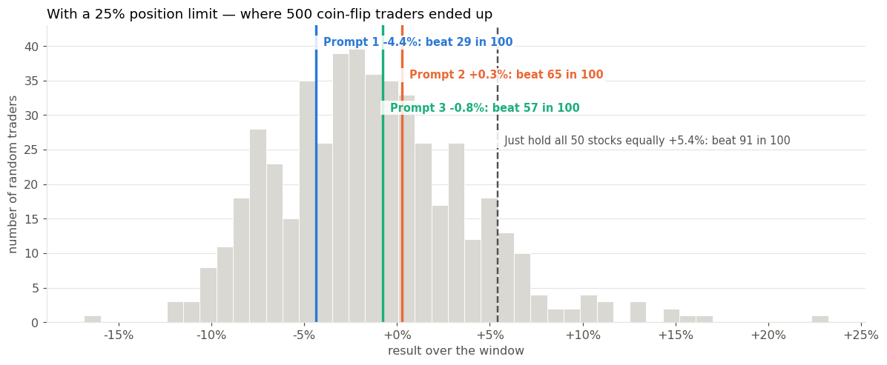

# agent-alpha-bench

An evaluation harness for LLMs acting as medium-term US-equity investors, inspired by
[TradeRank's AI trading leaderboard](https://www.traderank.ai/ai-trading-leaderboard).
Every model faces identical data, rules and costs; the harness measures not just who made
money but whether the judgement was any good (calibration, ablations, controls).

See `BLUEPRINT.md` for the design and roadmap. MIT licensed; a research harness, not investment advice.

## Results, in one picture

**Start with [`notebooks/04_the_story.ipynb`](notebooks/04_the_story.ipynb) — the whole experiment in plain language, no code to read.**



One summer, one 8B model (Qwen3 on a laptop), three prompts, 50 large US stocks, the leaderboards' rules plus a
25% position limit. Every prompt is scored against two things no leaderboard shows: a do-nothing portfolio and
1,000 random traders playing by the same rules. Under the leaderboards' rules one prompt finished +11%, which
turned out to be a single lucky bet that the position limit removes. With the limit, all three prompts land in the
middle of the random pack; holding all 50 stocks beat 91 of 100 coin-flippers without a single decision. And the
model stated 85% confidence on every one of its 50 trades, while 7–25% of them made money.

## Disclaimer

This is a research tool, not investment advice. Every result in this repository comes from a
paper-trading simulation over a short historical window, with simplified rules and costs;
none of it is a live track record, and past simulated performance says nothing about future
returns. Nothing here is a recommendation to buy, sell or hold any security, and no decision
should be based on the output of this code. Price data is fetched by the user from Yahoo Finance
under Yahoo's terms and is not distributed with this repository. The software is provided as is,
without warranty of any kind (see `LICENSE`).

## Quick start

```bash
conda env create -f environment.yml && conda activate alphabench   # or: pip install -r requirements.txt
python -m pytest                                             # engine unit tests
jupyter lab notebooks/01_data_and_engine.ipynb               # first run fetches ~3 years of prices and caches them
```

For the LLM notebooks, install [Ollama](https://ollama.com), pull a model (`ollama pull qwen3:8b`) and keep the app running;
`notebooks/02_first_llm_cycles.ipynb` talks to it on `localhost:11434`.

Ollama tips for this workload (prompts are ~9k tokens of numbers; prompt *reading* is the bottleneck on a laptop):
- set the app's **Context length** to 32k (menu-bar icon → Settings); the API `num_ctx` cannot exceed it. `ollama ps` shows the effective window.
- on Apple silicon, flash attention + an 8-bit KV cache usually speed up prompt reading and halve cache memory:
  `launchctl setenv OLLAMA_FLASH_ATTENTION 1 && launchctl setenv OLLAMA_KV_CACHE_TYPE q8_0`, then quit and relaunch the Ollama app.
- `ollama stop <model>` unloads a model so the next call picks up new settings. Paid providers go through
`OpenAICompatibleBackend` (set `OPENROUTER_API_KEY` or similar).

## Layout

```
alphabench/            package: universe, market, screener, prompt, schema, engine, agents/ (rules + llm), metrics, null, compare, replay
data/llm_cache/ every LLM prompt/response keyed by content hash (replays are reproducible; delete to refetch)
notebooks/      01 data+engine, 02 first LLM cycles, 03 model/prompt comparison, 03_new_rule = 03 with a 25% position limit,
                04 the story — the same results explained for non-specialists (reads data/summary/, no model calls)
data/summary/   the few tables notebook 04 reads (committed; written by scripts/export_summary.py from the 03 runs)
tests/          engine, controls, null-distribution and LLM-agent tests
data/           price cache and replay results (gitignored)
```

## Regenerating the notebooks

The notebooks are generated, so edit `scripts/make_notebook*.py` and not the `.ipynb` — anything typed
into a cell is lost the next time the generator runs. Notebooks 03 and 03_new_rule come from **one**
generator, which is what keeps them the same experiment:

```bash
python scripts/make_notebook_03.py              # -> notebooks/03_model_comparison.ipynb
python scripts/make_notebook_03.py --cap 0.25   # -> notebooks/03_new_rule_model_comparison.ipynb
python scripts/export_summary.py                # -> data/summary/  (from the two runs above)
python scripts/make_notebook_04.py              # -> notebooks/04_the_story.ipynb (plain-language version; runs in seconds)
```

Notebook 04 is the one to send to someone who is not a data scientist: one question per section, one picture per
question, no code to read. It never calls a model — `alphabench/report.py` draws everything from `data/summary/`.

A generated notebook has no outputs. Regenerate first, then Run All; every LLM call and every null run
is cached, so a re-run takes minutes rather than hours.

## Reproducibility

The decision window is pinned inside each notebook, so results do not move when the price cache is
refreshed. Two things sit outside that: yfinance adjusts prices retroactively for splits and dividends,
so a fresh clone can see slightly different history for the same dates; and `data/llm_cache/` is what
makes a re-run free — delete it and the models are queried again, and a local model is not bit-identical
across versions. Cached, the notebooks replay exactly. Uncached, treat a run as a re-run rather than a replay.

## Position limit

`Portfolio(max_position_weight=0.25)` / `run_replay(..., max_position_weight=0.25)` / `run_compare.py --cap 0.25` cap every
name at a share of equity, on opens and adds, for every agent; the cap is also stated in the prompt (`mandate(..., max_position_weight=)`).
Default is no cap (the leaderboards' rules). Notebook `03_new_rule_model_comparison` is notebook 03 with the cap on; results
land in `data/results/compare_universe_cap25/` and null caches carry a `_cap25` tag.

## Candidate modes

`build_base(..., candidates=...)` decides what the model may trade. `"universe"` (the default in notebook 03 and
`scripts/run_compare.py`): all 50 names are candidates, each with a feature row in the universe table, candles only for
held names and SPY. `"screened"`: the original daily top-5 funnel (dollar volume × recent move) with candles for those
five. The first comparison ran with the funnel; 1,000 random traders under each mode (`alphabench/null.py`) showed the funnel
alone moved the median outcome by more than any model or prompt did, so the whole-universe mode is now the default and
the two modes keep separate results (`data/results/compare*` ) and separate cache entries (the system prompt differs).
